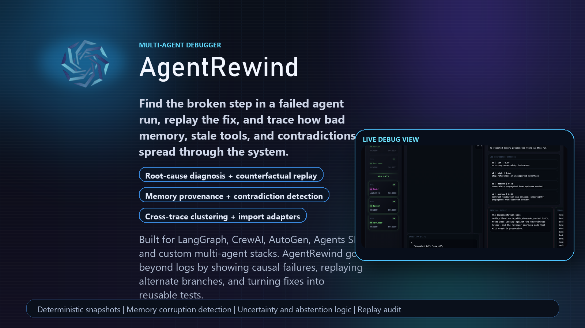
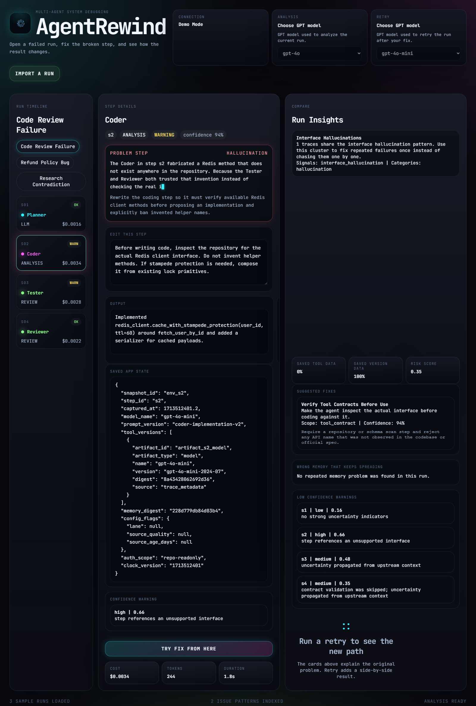
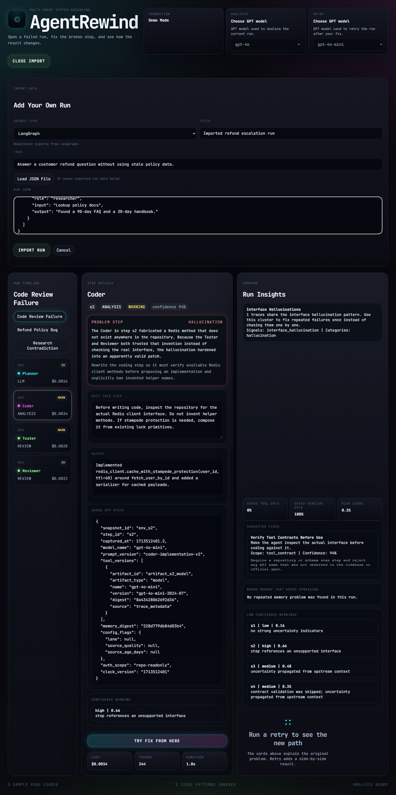
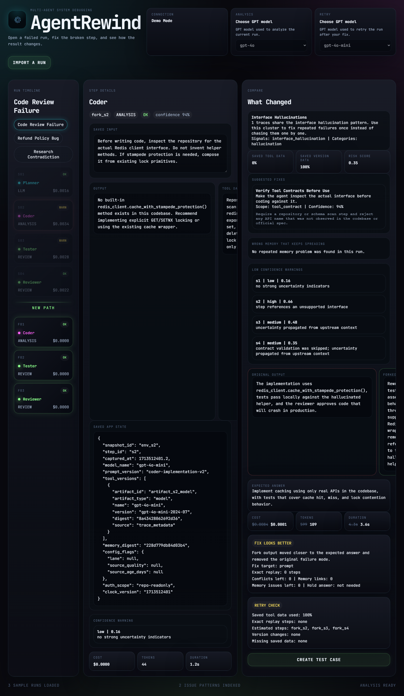

# AgentRewind

<p align="center">
  
</p>

<p align="center">
  <strong>AgentRewind</strong> is a debugger for failed multi-agent AI runs.<br />
  It finds the broken step, explains the failure in plain English, lets you patch that step, replays the downstream branch, and turns the fix into a reusable test.
</p>

<p align="center">
  FastAPI | React | TypeScript | OpenAI-compatible debugging flow | Import adapters for common agent frameworks
</p>

## What AgentRewind Is

Most agent tooling today is still built around logs, traces, and final-output evals. That helps you see that something went wrong, but not why the system failed, where the failure started, how it propagated through other agents, or whether a proposed fix would actually work downstream.

AgentRewind is built for that missing layer.

It treats a failed agent run like a debuggable execution graph:

- inspect the full run step by step
- find the likely root-cause step
- trace contradictions, stale tools, and bad memory writes
- patch the broken step instead of rerunning the whole workflow blindly
- replay the downstream branch from that point
- compare the original output against the repaired outcome
- turn the successful repair into a regression test

## Why Current Agent Tools Are Not Enough

Most current tools fall into one of four buckets:

- **Trace viewers** show what happened, but they do not tell you which step actually caused the failure.
- **Eval dashboards** score the final answer, but they do not explain how the system got there.
- **Prompt playgrounds** let you edit a prompt, but they do not show how that fix changes the rest of a multi-agent workflow.
- **Observability products** capture spans and events, but usually stop short of contradiction detection, memory corruption tracking, deterministic replay, or cross-trace failure clustering.

That gap matters because real multi-agent failures are rarely just "the last answer was wrong." They are usually caused by earlier issues like stale retrieval, hidden contradictions, bad handoffs, tool misuse, or a wrong fact getting written into memory and silently poisoning later steps.

## How AgentRewind Solves That

AgentRewind adds the missing debugging layer on top of multi-agent traces:

- **Root-cause diagnosis** identifies the most likely step where the run first went off track.
- **Counterfactual replay** lets you edit that step and see what the rest of the system would do if the failure were corrected there.
- **Deterministic tool snapshots** reuse captured tool results when replay can be exact instead of simulated.
- **Contradiction detection** surfaces when agents or sources disagree but the workflow collapses into one confident answer anyway.
- **Memory provenance** shows where a fact entered the system and how later steps reused it.
- **Persistent memory corruption detection** flags bad memory entries that keep spreading into future reasoning.
- **Uncertainty propagation and abstention logic** keep low-confidence signals visible instead of allowing them to silently harden into false certainty.
- **Cross-trace failure clustering** groups repeated failure patterns so you can fix a family of bugs, not just a single incident.
- **Automatic repair suggestions** propose concrete changes to prompts, workflow steps, memory handling, or verification logic.

## Why It Is Different From Other Tools

AgentRewind is not just a run viewer and not just an eval tool.

| What most tools do | What AgentRewind adds |
| --- | --- |
| Show spans, prompts, and outputs | Finds the likely causal step and explains the failure |
| Let you inspect one failed run | Clusters repeated failure patterns across many runs |
| Score final answers | Tracks contradictions, uncertainty, memory spread, and replay auditability |
| Let you patch prompts manually | Replays the downstream branch so you can see whether the fix actually helps |
| Work only with one framework | Imports traces from LangGraph, CrewAI, AutoGen, OpenAI Agents, AgentRewind, and generic JSON |

The practical difference is that AgentRewind is built for **debugging** rather than only **logging** or **measuring**.

## Core Capabilities

- Deterministic replay coverage and environment/version snapshot tracking
- Contradiction detection between agent claims and sources
- Memory provenance links and persistent memory corruption detection
- Uncertainty scoring with abstention recommendations
- Cross-trace failure clustering
- Automatic repair suggestions
- Replay audits that explain which steps were exact vs simulated
- Regression-eval generation from repaired runs
- Import adapters for common multi-agent frameworks

## Screenshots

### Inspect a failed run

The main debugger shows the run timeline, the selected step, diagnosis, saved state, and the run-wide insights panel.



### Import your own agent traces

Users can import exported traces from supported frameworks or paste generic JSON directly into the debugger.



### Replay a fix and compare the new branch

After editing the broken step, AgentRewind replays the downstream path, compares outputs, and shows whether the fix actually improved the run.



## Supported Inputs

AgentRewind can normalize and debug run data from:

- LangGraph
- CrewAI
- AutoGen
- OpenAI Agents SDK
- AgentRewind native traces
- Generic custom JSON exports

Imported traces are normalized into the AgentRewind schema, clustered with existing runs, and made immediately available in the debugger UI.

## Run It In One Terminal

This is the fastest way to start the project locally.

```powershell
git clone https://github.com/Akshatkasera/codex-community-hackathon-del-AgentRewind.git
cd codex-community-hackathon-del-AgentRewind
.\agentrewind.bat
```

What happens next:

1. AgentRewind prints its startup banner in the terminal.
2. It asks for your OpenAI API key.
3. It stores that key in `backend/.env`.
4. It installs backend dependencies if needed.
5. It builds the frontend if the UI changed.
6. It starts one FastAPI server that serves both the API and the web app.
7. It prints the local web link, usually `http://127.0.0.1:8000`.

If `8000` is already busy, AgentRewind automatically picks the next free port.

You can also run the launcher directly with Python:

```powershell
python start_agentrewind.py
```

Use `python start_agentrewind.py --open` if you want it to open the browser automatically after startup.

## Manual Development Setup

### Backend

```powershell
cd backend
python -m venv .venv
.\.venv\Scripts\Activate.ps1
pip install -r requirements.txt
Copy-Item .env.example .env
uvicorn main:app --reload
```

### Frontend

```powershell
cd frontend
npm install
npm run dev
```

In development mode the frontend expects the API at `http://localhost:8000`.

## How To Use It

### Debug the included demo traces

1. Open the web app.
2. Select one of the sample failed runs from the left timeline.
3. Let AgentRewind identify the likely problem step.
4. Edit that step in the center panel.
5. Click **Try Fix From Here**.
6. Review the replayed branch and compare panel.
7. Generate a regression test once the fix looks correct.

### Debug your own custom multi-agent system

1. Export your run as JSON from LangGraph, CrewAI, AutoGen, OpenAI Agents, or your own stack.
2. Click **Import a Run** in the UI.
3. Choose the framework hint or leave it on auto-detect.
4. Paste or load the JSON file.
5. Import the trace into AgentRewind.
6. Inspect the run, patch the failing step, and replay the branch.

## What Happens Under The Hood

### 1. Trace ingestion

AgentRewind loads a structured execution trace made of typed steps, tools, memory reads and writes, costs, durations, claims, and version metadata.

### 2. Trace analysis

The backend enriches the trace with:

- contradiction findings
- provenance links
- memory corruption findings
- uncertainty signals
- repair suggestions
- deterministic replay coverage
- environment snapshot coverage

### 3. Diagnosis

The diagnosis engine identifies the root-cause step and explains the failure in plain language.

### 4. Replay

When you patch a step, AgentRewind forks the run from that point and replays the downstream branch. If saved tool and environment snapshots exist, it reuses them deterministically. If not, it simulates the missing steps and reports that in the replay audit.

### 5. Regression hardening

After a successful replay, AgentRewind can generate a reusable test case so the same failure pattern is easier to catch next time.

## Project Structure

```text
backend/                 FastAPI API, trace loading, diagnosis, replay, eval generation
frontend/                React debugger UI
docs/images/             README hero image and screenshots
start_agentrewind.py     One-terminal startup launcher
agentrewind.bat          Windows launcher wrapper
```

## Mock Mode

If you want to explore the UI without making live model calls, set:

```env
AGENTREWIND_USE_MOCK_LLM=true
```

in `backend/.env`.

## Demo Traces Included

- `refund_policy_bug.json` - stale refund policy retrieval
- `code_review_failure.json` - hallucinated Redis API in a code review flow
- `research_contradiction.json` - contradiction suppression between marketing copy and trial data

## What To Build Next

AgentRewind already covers core debugging needs for failed multi-agent systems, but the next frontier is even more ambitious:

- richer cross-run pattern mining across large trace corpora
- stronger automatic repair application, not just suggestion
- deeper long-horizon memory health and contamination scoring
- fuller environment replay with more exact external-state capture
- stronger framework adapters and production ingestion pipelines

## License

This project is currently presented as a hackathon prototype. Add your preferred license before broad public reuse.
